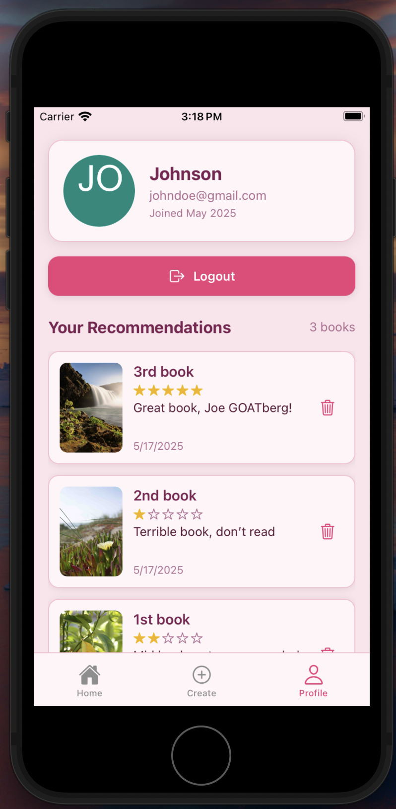
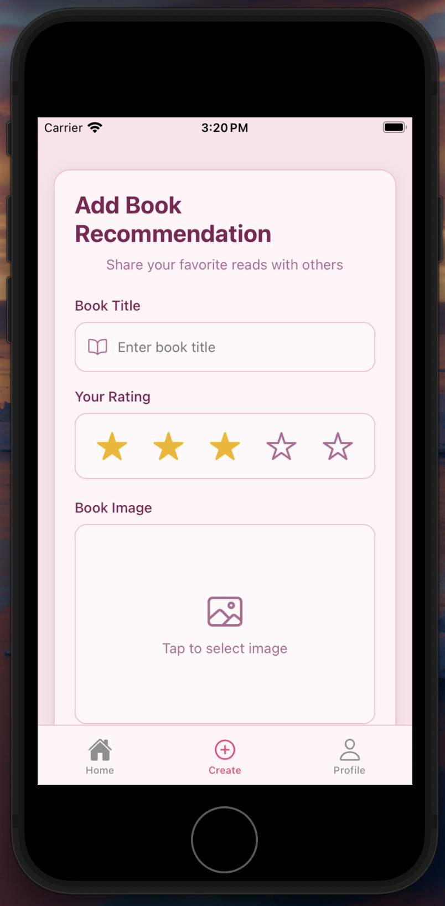
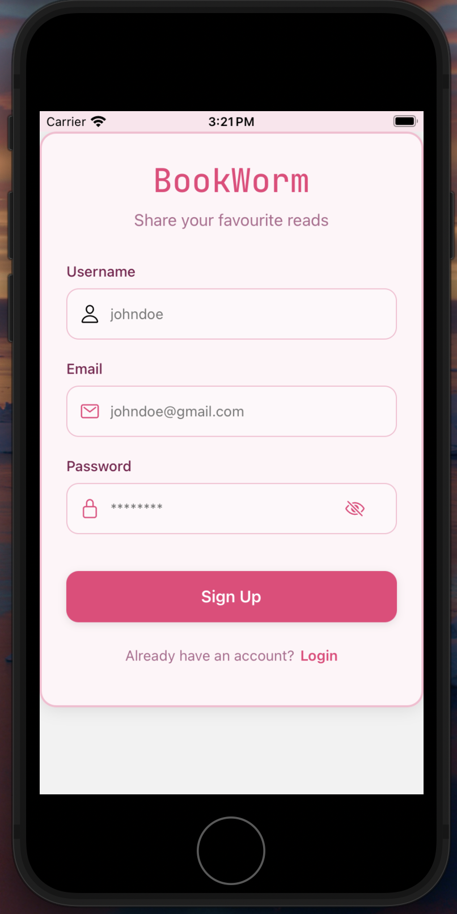

# Bookworm App 📚

Bookworm App is a full-stack mobile application that allows users to share and explore book recommendations. Users can create, view, and delete book recommendations, as well as manage their profiles.

## Features
- **User Authentication**: Secure login and registration using JWT.
- **Book Recommendations**: Users can create, view, and delete their book recommendations.
- **Image Upload**: Upload book cover images with support for cloud storage.
- **Pagination**: Efficiently load books with pagination.
- **Profile Management**: View and manage user-specific book recommendations.
- **Responsive Design**: Optimized for mobile devices using React Native.

---

### 📸 **Screenshots**

| **Home Page**                | **Profile Page**             |
|-------------------------------|------------------------------|
|  |  |

| **Create Page**              | **Login Page**               |
|-------------------------------|------------------------------|
|  |  |

| **Signup Page**              |
|-------------------------------|
|  |

---

## Tech Stack
### Frontend
- **React Native**: For building the mobile app.
- **Expo Router**: For navigation and routing.
- **Context API / Zustand**: For state management.
- **React Native Safe Area Context**: For handling safe areas on mobile devices.

### Backend
- **Node.js**: Backend runtime.
- **Express.js**: Web framework for building RESTful APIs.
- **MongoDB**: NoSQL database for storing user and book data.
- **Mongoose**: ODM for MongoDB.
- **Cloudinary**: For image storage and management.

---

## Installation

### Prerequisites
- **Node.js** (v16 or higher)
- **MongoDB** (local or cloud instance)
- **Expo CLI** (for running the React Native app)

### Backend Setup
1. Clone the repository:
   ```bash
   git clone https://github.com/janiussyafiq/bookworm-app.git
   cd bookworm-app/backend
   ```
2. Install dependencies:
    ```bash
    npm install
    ```
3. Create a .env file in the backend directory and add the following:
    ```bash
    PORT=5000
    MONGO_URI=your-mongodb-connection-string
    JWT_SECRET=your-jwt-secret
    CLOUDINARY_CLOUD_NAME=your-cloudinary-cloud-name
    CLOUDINARY_API_KEY=your-cloudinary-api-key
    CLOUDINARY_API_SECRET=your-cloudinary-api-secret
    ```
4. Start the backend server:
    ```bash
    npm start
    ```

### Frontend Setup
1. Navigate to the mobile app directory:
```bash
    cd ../mobile
```
2. Install dependencies:
```bash
    npm install
```
3. Create a .env file in the mobile directory and add the following (or your own backend server that has been deployed):
```bash
    API_URL=http://localhost:5000
```
4. Start the Expo development server:
```bash
    npx expo start
```
5. Scan the QR code with the Expo Go app on your mobile device to run the app.

### Usage
1. Register or log in to the app.
2. Create a new book recommendation by providing a title, caption, rating, and image.
3. View your recommendations on the profile page.
4. Explore other users' recommendations on the main feed.

### Folder Structure
```bash
bookworm-app/
├── backend/                # Backend code
│   ├── src/
│   │   ├── models/         # Mongoose models
│   │   ├── routes/         # Express routes
│   │   ├── middleware/     # Authentication and other middleware
│   │   └── server.js       # Entry point for the backend
│   └── package.json        # Backend dependencies
├── mobile/                 # Frontend code
│   ├── app/                # Expo Router pages
│   ├── components/         # Reusable React Native components
│   ├── constants/          # App-wide constants (e.g., colors)
│   ├── store/              # State management (e.g., Zustand)
│   └── App.js              # Entry point for the mobile app
└── README.md               # Project documentation
```

## API Endpoints

### Authentication
- **`POST /api/auth/register`**: Register a new user.
- **`POST /api/auth/login`**: Log in a user.

### Books
- **`GET /api/books`**: Get all books with pagination.
- **`GET /api/books/user`**: Get books by the logged-in user.
- **`POST /api/books`**: Create a new book recommendation.
- **`DELETE /api/books/:id`**: Delete a book recommendation.

---

## Contributing

Contributions are welcome! Please follow these steps:

1. Fork the repository.
2. Create a new branch:
   ```bash
   git checkout -b feature-name
   ```
3. Commit your changes:
```bash
   git commit -m "Add feature"
```
4. Push to the branch:
```bash
   git push origin feature-name
```
4. Open a pull request

## License
This project is licensed under the MIT License. 

## Acknowledgments
- React Native
- Expo
- MongoDB
- Cloudinary

## Contact
For any questions or feedback, feel free to reach out:

Email: izzraff.js@gmail.com
GitHub: janiussyafiq